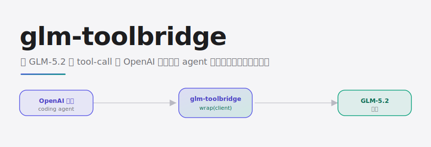
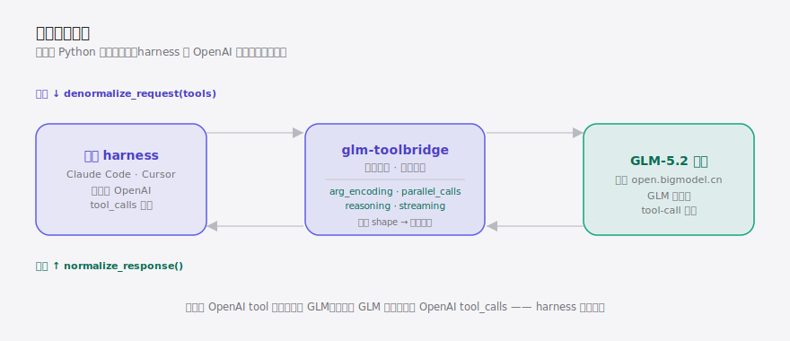

<div align="right"><sub><b>English</b>&nbsp;&nbsp;⇄&nbsp;&nbsp;<a href="./README.md">简体中文</a></sub></div>

<picture>
  <source media="(prefers-color-scheme: dark)" srcset="./assets/hero-dark.svg">
  <source media="(prefers-color-scheme: light)" srcset="./assets/hero-light.svg">
  
</picture>

<p><sub>Run GLM-5.2 behind any OpenAI-format coding agent without tool calls silently mis-parsing — a thin protocol adapter that leaves your harness's OpenAI code path untouched.</sub></p>

<p align="center">
  <a href="./LICENSE"></a>
  <a href="https://github.com/SuperMarioYL/glm-toolbridge/releases"></a>
  <a href="https://github.com/SuperMarioYL/glm-toolbridge/actions/workflows/ci.yml"></a>
  
  
  
</p>

**Point GLM-5.2 at a coding agent that hardcodes OpenAI `tool_calls` parsing and the tool loop silently mis-parses and stalls; `glm-toolbridge` slips one `wrap()` line in between so that loop just runs.**

Developers increasingly run GLM-5.2 (智谱) as the backend behind a **Claude Code**-style harness or any other **Coding Agent** — but those harnesses assume the other end speaks OpenAI/Anthropic's function-call protocol. GLM-5.2's tool calls diverge from the OpenAI shape in four places (argument encoding, parallel-call framing, reasoning interleave, streaming assembly), so `json.loads(arguments)` throws, a non-null `content` gets treated as a final turn, and parallel calls fail to correlate by id — mostly **silently**. Tools like [farion1231/cc-switch](https://github.com/farion1231/cc-switch), built around swapping the model backend behind one harness, are turning this into a daily workflow, and the breakage bites the moment GLM is the backend. `glm-toolbridge` folds that divergence into a transparent proxy: your OpenAI code path is unchanged, and GLM's responses come back to the harness already in the valid OpenAI `tool_calls` shape.

---

<h2> Architecture</h2>

<picture>
  <source media="(prefers-color-scheme: dark)" srcset="./assets/atlas-dark.svg">
  <source media="(prefers-color-scheme: light)" srcset="./assets/atlas-light.svg">
  
</picture>

A single-process Python library — no service, no daemon. `wrap(client)` returns a transparent proxy with the exact same interface as your client:

- **Outbound** `denormalize_request(tools)` — lowers OpenAI-shaped tool definitions into the request body GLM-5.2 accepts;
- **Inbound** `normalize_response()` — restores GLM's response into the OpenAI `tool_calls` shape the harness expects;
- On any shape no documented delta covers, it raises a **named, explicit error** (`UnsupportedProtocolShape` / `MalformedToolArguments` / `StreamAssemblyError`) instead of returning a half-parsed structure that breaks the harness three frames later — the opposite of today's silent mis-parsing.

<h2> Install</h2>

```bash
uv add glm-toolbridge        # or: pip install glm-toolbridge
```

<h2> Quickstart</h2>

Cold clone to first visible result in three commands:

```bash
git clone https://github.com/SuperMarioYL/glm-toolbridge && cd glm-toolbridge
uv sync
uv run python examples/openai_harness_demo.py
```

<details>
<summary>sample output</summary>

```text
================================================================
  glm-toolbridge demo — same OpenAI harness, GLM-5.2 backend
================================================================

[LEFT] stock harness against raw GLM-5.2 ...
  ✗ tool loop broke: TypeError: the JSON object must be str, bytes or bytearray, not dict
    (GLM sent arguments as a native object; json.loads chokes — the silent breakage devs hit today.)

[RIGHT] same harness, one-line wrap: client = wrap(client) ...
  ✓ tool loop completed: Beijing: 21 celsius, clear
    (arguments normalized to a JSON string, content forced null, reasoning relocated — the harness never knew GLM was behind it.)
```

</details>

<h2> Usage</h2>

`glm-toolbridge` exposes three layers; reach for whichever you need. A full runnable example lives in [`examples/openai_harness_demo.py`](examples/openai_harness_demo.py).

### 1. One-line drop-in (recommended)

Wrap your existing OpenAI-SDK client; everything downstream stays the same:

```python
from openai import OpenAI
from glm_toolbridge import wrap, GLM_DEFAULT_BASE_URL

client = wrap(OpenAI(base_url=GLM_DEFAULT_BASE_URL, api_key="your-zhipu-key"))

resp = client.chat.completions.create(
    model="glm-5.2",
    messages=[{"role": "user", "content": "weather in Beijing?"}],
    tools=[...],   # your existing OpenAI-shaped tool definitions
)
resp.choices[0].message.tool_calls   # already valid OpenAI shape
```

### 2. Pure transforms (no client wrapping)

Operate directly on the wire-shape dicts — ideal for harnesses that own their request/response loop:

```python
from glm_toolbridge import normalize_response, denormalize_request

glm_kwargs = denormalize_request(openai_request)   # OpenAI tool defs → GLM request body
result = normalize_response(glm_raw_response)       # GLM response → OpenAI shape
result.completion.tool_calls          # pydantic-validated typed view
result.as_openai_dict()               # the plain dict the harness consumes
result.deltas_applied                 # which deltas actually fired this time
```

For streamed responses, hand the list of chunks to `assemble_stream()` (or pass the chunk list straight to `normalize_response()`) to reassemble one complete call first, then transform as above.

### 3. Protocol audit (see exactly what differs)

All four deltas are executable detectors you can query individually:

```python
from glm_toolbridge import DELTAS, deltas_present

for d in DELTAS:
    print(d.kind.value, "—", d.summary)

deltas_present(glm_raw_response)   # → [DeltaKind.ARG_ENCODING, DeltaKind.REASONING_INTERLEAVE, ...]
```

The full divergence table is in [`docs/PROTOCOL_DELTAS.md`](docs/PROTOCOL_DELTAS.md).

<h2> Demo</h2>


The same OpenAI-format harness: on the left it talks to GLM-5.2 directly and the tool loop silently stalls; on the right one extra `wrap()` line makes the identical tool call parse and the loop complete.

<h2> Roadmap</h2>

- [x] **m1 protocol audit** — the four GLM-5.2 vs OpenAI tool-call deltas captured in `docs/PROTOCOL_DELTAS.md` with fixtures, each backed by an executable detector
- [x] **m2 bidirectional adapter** — `normalize()` / `denormalize()` pass roundtrip tests across all four divergence fixtures
- [x] **m3 drop-in wrapper** — `wrap()` transparently adapts an OpenAI-SDK client; `examples/` shows fail-without / work-with
- [ ] Cover more GLM-5.2 tool-call edge cases (add deltas as real issues surface them)
- [ ] Anthropic Messages-format adaptation (today: OpenAI `tool_calls` only)
- [ ] Possibly extend to other Chinese model protocols — only if demand shows; depth over breadth

> Out of scope for v0.1: web UI / dashboard, adapters for other models (Qwen / Kimi / DeepSeek / 豆包 / MiniMax), our own coding agent, a hosted service / billing, fine-tuning.

<h2> License & Contributing</h2>

MIT licensed — see [LICENSE](./LICENSE). Issues and PRs welcome — especially if you hit a GLM-5.2 tool-call shape no current delta covers: paste the response into an issue and we'll add a delta.

---

<p align="center"><sub><a href="./LICENSE">MIT</a> © 2026 SuperMarioYL</sub></p>
