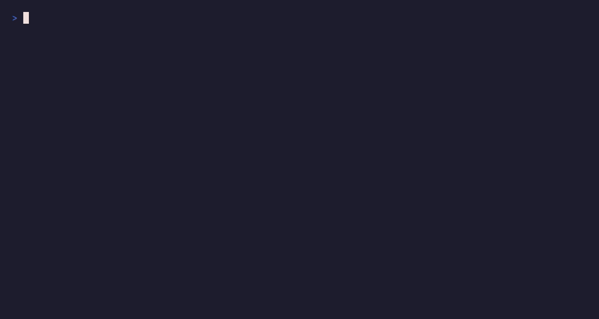

[English](./README.en.md) · [Website](https://glm-toolbridge.lei6393.com/) · [GitHub](https://github.com/SuperMarioYL/glm-toolbridge)

<picture>
  <source media="(max-width: 600px) and (prefers-color-scheme: dark)" srcset="./assets/presentation/hero-mobile-dark.svg">
  <source media="(max-width: 600px)" srcset="./assets/presentation/hero-mobile-light.svg">
  <source media="(prefers-color-scheme: dark)" srcset="./assets/presentation/hero-dark.svg">
  
</picture>

# glm-toolbridge

**让工具参数匹配现有调用框架。**

glm-toolbridge 将已支持的 GLM 风格工具调用形状转换成 Python 调用框架期望的 OpenAI 兼容结构。

## 为什么需要它

工具分发器可能要求 arguments 为 JSON 字符串，而响应却给出对象。把协议转换集中到适配层，工具分发器便可沿用已有输入契约。

- **集中协议边界** — 转换逻辑集中在工具分发代码之外。
- **多种调用模式** — 同步、异步与流式适配共用归一化逻辑。
- **明确失败** — 未支持形状产生明确命名的错误。

## 架构

<picture>
  <source media="(max-width: 600px) and (prefers-color-scheme: dark)" srcset="./assets/presentation/architecture-mobile-dark.svg">
  <source media="(max-width: 600px)" srcset="./assets/presentation/architecture-mobile-light.svg">
  <source media="(prefers-color-scheme: dark)" srcset="./assets/presentation/architecture-dark.svg">
  
</picture>

请求转换准备工具定义；响应归一化处理已支持的参数编码、并行调用和推理字段差异。客户端包装器将转换应用于同步、异步和流式结果，未支持形状通过明确错误报告。

| 组件 | 职责 |
| --- | --- |
| `Client wrapper` | src/glm_toolbridge/client.py |
| `Request adapter` | adapter.py |
| `Normalize / assemble` | normalize.py |
| `Typed result` | OpenAI-compatible response |

## 安装与快速上手

使用仓库清单指定的运行时版本构建，并在仓库根目录运行示例。

```bash
git clone https://github.com/SuperMarioYL/glm-toolbridge.git
cd glm-toolbridge
uv venv .venv
uv pip install --python .venv/bin/python -e .
source .venv/bin/activate
```

随仓 Python 脚本定义完整的对象参数响应，并打印归一化后的消息。

```bash
.venv/bin/python examples/presentation-demo.py
```

## 实际运行示例

<picture>
  <source media="(max-width: 600px) and (prefers-color-scheme: dark)" srcset="./assets/presentation/process-mobile-dark.svg">
  <source media="(max-width: 600px)" srcset="./assets/presentation/process-mobile-light.svg">
  <source media="(prefers-color-scheme: dark)" srcset="./assets/presentation/process-dark.svg">
  
</picture>

The weather call arguments become a JSON string while the call ID and function name remain available.

```text
{
  "role": "assistant",
  "tool_calls": [
    {
      "id": "call-1",
      "type": "function",
      "function": {
        "name": "weather",
        "arguments": "{\"city\":\"Beijing\"}"
      }
    }
  ],
  "content": null,
  "_glm_reasoning": "Checking the city"
}
```

完整命令与输出保存在 [docs/demo-results.json](./docs/demo-results.json). 输入和复现代码均随仓提供。



保留已有录制供参考；上方文字示例给出当前可复现的操作。

## 用法

CLI 提供以下操作。示例之外的命令需要替换成你的文件路径或标识。

```bash
# Offline before/after harness example:
.venv/bin/python examples/openai_harness_demo.py
```

## 配置

同步 OpenAI 客户端使用 wrap(client)，异步客户端使用 awrap(client)。端点、模型和凭据在原客户端配置；纯函数 normalize_response 与 denormalize_request 无需密钥。

```python
from glm_toolbridge import normalize_response
raw = {"choices": [{"index": 0, "message": {"role": "assistant", "tool_calls": [{"id": "call-1", "type": "function", "function": {"name": "weather", "arguments": {"city": "Beijing"}}}]}, "finish_reason": "tool_calls"}]}
normalized = normalize_response(raw).as_openai_dict()
```

## 集成与职责分工

<picture>
  <source media="(max-width: 600px) and (prefers-color-scheme: dark)" srcset="./assets/presentation/integrations-mobile-dark.svg">
  <source media="(max-width: 600px)" srcset="./assets/presentation/integrations-mobile-light.svg">
  <source media="(prefers-color-scheme: dark)" srcset="./assets/presentation/integrations-dark.svg">
  
</picture>

以下路径已有源码实现。按任务选择输入，并把生成的结果与项目一起保存。

| 路径 | 已实现职责 |
| --- | --- |
| wrap / awrap | Synchronous and asynchronous clients |
| Response dictionaries | Pure normalization functions |
| Stream chunks | Delta normalization and assembly |
| Protocol errors | Named unsupported-shape failures |

## 限制与后续方向

- 示例使用合成响应，不代表当前 GLM 部署的实际行为，也不证明兼容所有 Agent 框架。
- 当前只适配已支持的 OpenAI 风格契约，Anthropic Messages 不在此范围。

后续根据可复现的响应示例扩展差异集合；其他模型协议与 Anthropic Messages 是后续方向。

## 许可与贡献

许可见 [LICENSE](./LICENSE). 反馈问题时请提供最小输入、执行命令和实际输出。
